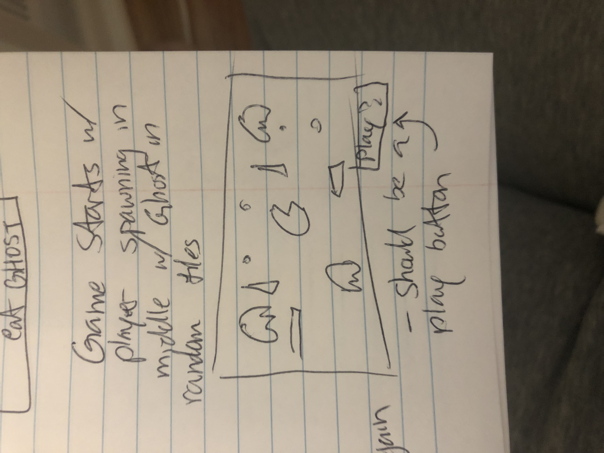
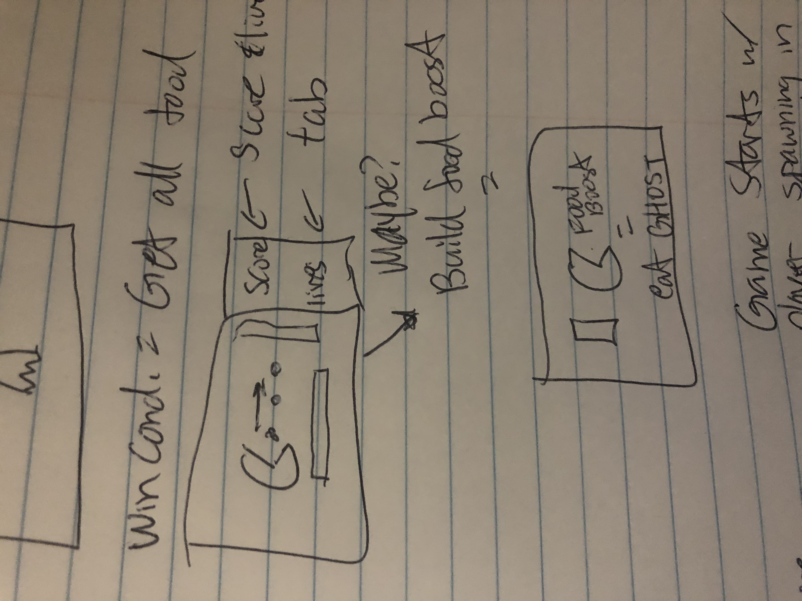
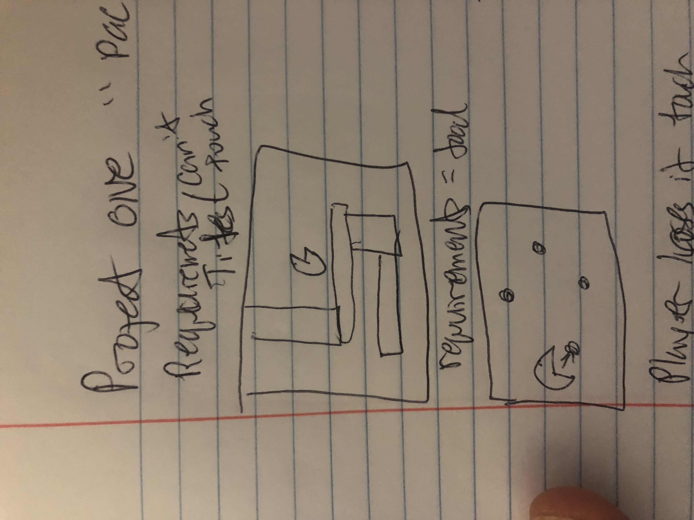
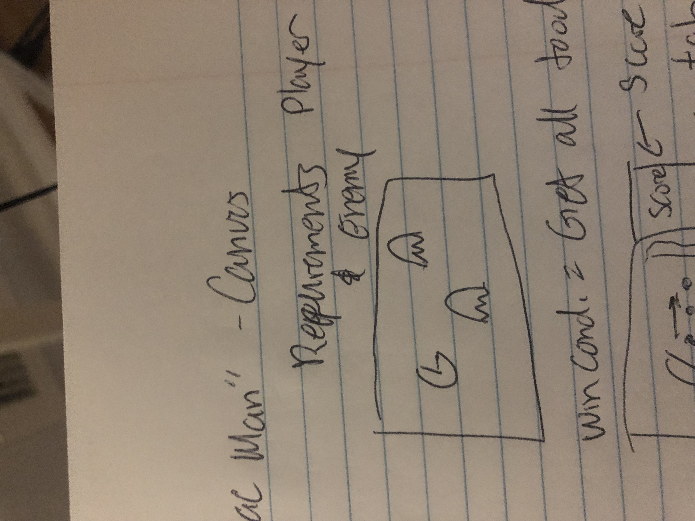
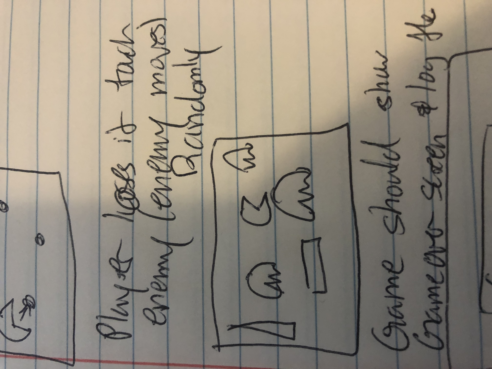
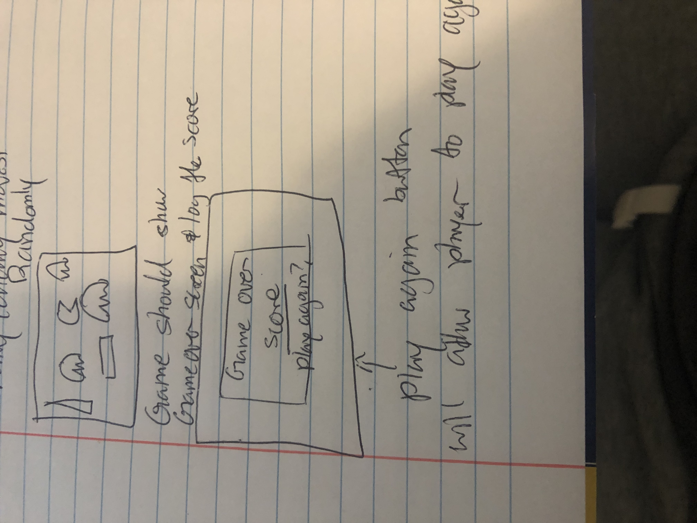

# Christopher-Lee-Game-Project 
# "Pacman lite game" 
>You have mysteriously spawned into a random room and hears a voice telling them the only way to get back to reality is to collect all the balls while avoiding the ghost...Can you achieve this goal or will you spend the rest of your life in here?

- Game will be created using HTML, css, Javascript and canvas 
- Game will start when players hits the "play game button"
- Player should be able to move with WASD keys
- Player should NOT be able to collide with walls 
- Players should be able to collide with 'food' pieces on the board
- foods eatten should increase points
- Goal of game is to eat all the food of the board WITHOUT dying
- Players should be able to collide with ghost however, collision should lead to death
- Players lose if a ghost collides with them 
- game over screen shall display with game over message with total points obtained 
- Ghost AI should have a random path 
- ghost should NOT be able to touch walls  as well and should be able to collide with player 
- *(Maybe) Super food will spawn randomly on board - should be eatable which will result in ghost being able to be eatten (if so, ghost should respond in a set time)* 
- If all food is gone, player wins
- game over - Gameover screen should display total points player has
- There should be a play again button

>Player should spawn in the game with blocks blocking you in while the enemy will try to chase you down

>Players goal is to collect all the balls(maybe gold coins?) while avoiding these ghost. Score with be shown on the right.

>Players and the enemy are NOT allowed to go through the blocks

>If player comes to contact with any ghost, they die

>Players are controlled via WASD or arrow keys while ghost have a random path

>Game is over once either all balls are collected (which in case will log win message) or player dies (which in case will log lose message). Game over message will indicate player score and an option to play again
